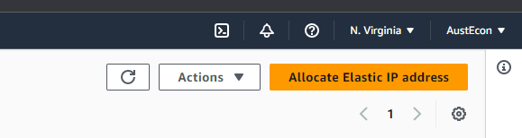
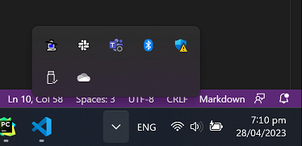

# ElectrumSV AWS Deployment Instructions
This AWS template creates an Amazon EC2 instance running Payd (a headless version of ElectrumSV) 
using Docker.

This instance is created within a specified VPC and subnet, and has an associated security group for 
SSH and API access. Note that creating an EC2 instance using this template will incur AWS charges.

To use this template, follow these steps:

## 1. Ensure you have an AWS account and are signed in to the AWS Management Console.
## 2. Make sure you have an existing EC2 KeyPair, VPC, and subnet (follow 2a or 2b respectively if you need to create these). 

### 2a) Create an EC2 KeyPair:

1. Navigate to the EC2 Dashboard in the AWS Management Console.
2. In the left sidebar, click on "Key Pairs" under "Network & Security."
3. Click "Create key pair."
4. Provide a name for your key pair, choose a file format (PEM or PPK), and click "Create key pair." (PPK format is
preferable for usage with putty - discussed later)
5. Your browser will download the private key file. Keep this file secure, as you'll need it to SSH into your instances.

### 2b) Create a VPC & subnet:

1. Navigate to the VPC Dashboard in the AWS Management Console.
2. In the left sidebar, click on "Your VPCs."
3. Click "Create VPC."
4. Provide a name for your VPC and a CIDR block (e.g., 10.0.0.0/16) for the IP address range. Leave the other settings as default, and click "Create VPC."
5. Your new VPC will be created and displayed in the VPC list.

NOTE: By default this will additionally create 2 subnets.

Now you have an EC2 KeyPair, a VPC, and subnet. Take note of their respective names or IDs, as they will be used as 
input parameters in the next step when deploying the template.

## 3. Deployment

1. Navigate to the CloudFormation service. The easiest method is to search for it in the search bar.
2. Click on 'Create Stack' and choose 'With new resources'.
3. Under 'Specify template', select 'Template is ready' and choose the option to upload the template file 
and click 'Next'.
4. Fill out the 'Stack name' with "PayD" and the required parameters:
   - KeyName: Enter the name of an existing EC2 KeyPair for SSH access.
   - SubnetID: Enter the ID of the existing subnet you want to deploy the instance into.
   - VPCID: Enter the ID of the existing VPC you want to deploy the instance into.
   - InstanceType: Choose the desired EC2 instance type (default is t3.small).
   - SSHLocation: Specify the IP address range (CIDR) allowed to SSH to the EC2 instances (default is 0.0.0.0/0, 
allowing access from any IP).
   - APILocation: Specify the IP address range (CIDR) allowed to access the EC2 instances on port 8443 
(default is 0.0.0.0/0, allowing access from any IP).
7. Click 'Next', and configure any additional options like tags, permissions, and advanced settings as needed.
8. Click 'Next' again, review your settings, and click 'Create Stack'. AWS will now create the resources specified 
in the template.
9. Once the stack creation is complete, check the 'Outputs' tab for information about the newly created EC2 instance, 
such as the instance ID, availability zone, and public DNS.

## 4. Assigning a public IP address (for SSH access and public access to the API)
To assign a public IP address to the running instance of PayD:

1. go to the EC2 dashboard and then click on "Elastic IPs" Which is located on the left-side pannel under "Network & Security".
2. Click on the "Allocate Elastic IP address" button (top-right corner).

3. Now click on the "Actions" button (top-right corner) and select "Associate Elastic IP address" from the drop-down menu.
4. Now associate the Elastic IP address to the running instance of PayD. Autocomplete will assist you when you click on
the fields of the form. 

## 5. Troubleshooting
To view the logs of the initial instance boot process:

1. Navigate to the EC2 Dashboard in the AWS Management Console.
2. In the left sidebar, click on "Instances"
3. Locate your EC2 instance in the instances list and click on it to view its details in the lower pane.
4. With the instance selected, click on the "Actions" dropdown menu at the top.
5. Under the "Actions" dropdown menu, select "Monitor and troubleshoot" > "Get System Log"
6. Now you should be able to see the system log for the EC2 instance.

## 6. SSH with putty
1. Run "pageant" and add your PPK private key to it. (Note pageant doesn't launch a window automatically, you need to
go to the bottom-right corner and double-click the small pageant icon - a PC with a hat on it):
2. 

2. Open putty and enter the allocated public IP address.
3. Natigate to Connection > Data > Auto-login username and put "ec2-user" as the username.
4. Save the configuration for later and open the SSH session.

If you want to switch to root user:

   > sudo su -

The repo is located at:

   > /liteclient-docker

If the deployment has been successful, you should be able to `cd` to the `liteclient-docker` and run:

   > docker-compose logs

and see this as the output:

      [ec2-user@ip-10-0-9-249 payd-data]$ docker-compose logs
      payd  | starting daemon...
      payd  | 000 - waiting for daemon to be ready..
      payd  | 000 - waiting for daemon to be ready..
      payd  | 000 - waiting for daemon to be ready..
      payd  | 000 - waiting for daemon to be ready..
      payd  | 000 - waiting for daemon to be ready..
      payd  | checking if we need to create a new wallet...
      payd  | true
      payd  | creating wallet...
      payd  | loading wallet...
      payd  | syncing headers...
      payd  | 425 - syncing headers, checking again in 10 seconds...
      payd  | service signup...
      payd  | wallet is ready to use via json-rpc, link to documentation:
      payd  | https://electrumsv.readthedocs.io/en/develop/building-on-electrumsv/node-wallet-api.html#api-usage

## PayD logs
The `liteclient-docker/payd-data` directory is a shared directory between host and docker instance (root/.electrum-sv)
so all logs of the currently running instance can be viewed in `payd-data/logs`.
